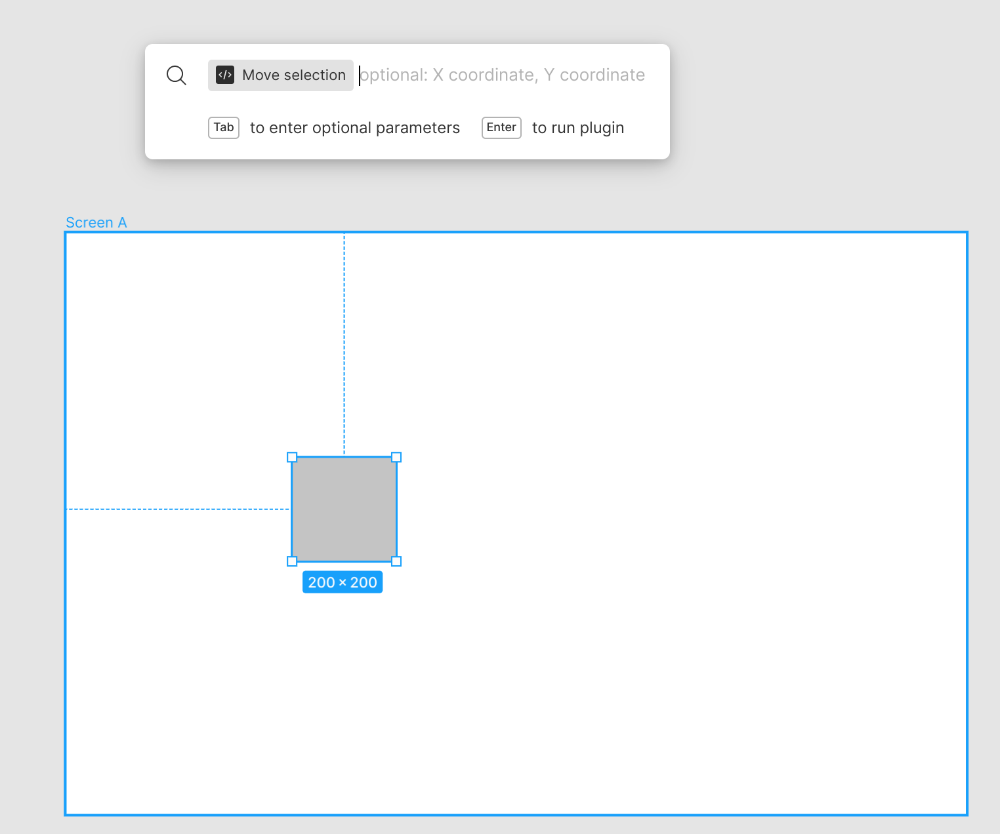

# move-it Figma Plugin

move-it is a [parameter driven](https://www.figma.com/plugin-docs/plugin-parameters/) Figma plugin that makes it easy to translate and scale objects with absolute or relative coordinates.

## Usage

To import the plugin into Figma, go to `Menu->Plugins->Development->Import manifest` and select the `manifest.json` file in the plugin's source folder. You can then access the plugin's commands in the Quick Actions bar (CTRL + /).

## Commands

### Move Selection

The `Move Selection` command takes two optional parameters, the X coordinate and Y coordinate. By default, these are absolute coordinates. Adding a `+` or `-` before the coordinate makes it relative to the selections current position.

### Resize Selection

The `Resize Selection` command takes two optional parameters, the Width and Height. By default, these are absolute values. Adding a `+` or `-` before the dimension makes it relative to the selections current width or height.

## Building

Use `npm run build` to set Parcel bundler in watch mode. Files are output to the `dist` folder.
